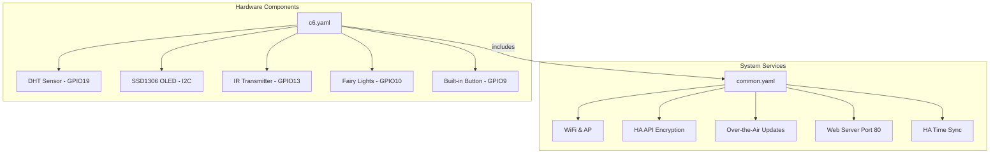

# ESPHome C6 Project

This project configures an **ESP32-C6** (specifically the `esp32-c6-devkitc-1`) using ESPHome. It features environmental sensing, an OLED display, IR remote control capabilities, and integration with Home Assistant.

## 🏗 Architecture Overview

The configuration is split into a modular structure:
- [`common.yaml`](common.yaml): Contains base networking, security, and system-level configurations.
- [`c6.yaml`](c6.yaml): Contains device-specific hardware mappings and logic for the ESP32-C6.



## 🛠 Features & Hardware Mapping

### 1. Connectivity & System
- **WiFi**: Configured with a fallback hotspot (Captive Portal).
- **Web Server**: Enabled on port 80 for local control.
- **Time**: Synchronized via Home Assistant (`ha_time`).
- **Security**: Encrypted API and password-protected OTA/Web interface.

### 2. Sensors & Inputs
| Component | Pin | Description |
| :--- | :--- | :--- |
| **DHT Sensor** | `GPIO19` | Monitors Temperature and Humidity every 15s. |
| **Binary Sensor** | `GPIO9` | Built-in button (inverted, with 10ms debouncing). |

### 3. Outputs & Displays
- **OLED Display**: SSD1306 (128x32) on I2C (`SDA: GPIO4`, `SCL: GPIO5`).
  - Supports dynamic text rendering via a template text entity.
  - Automatically centers text or splits it into two lines if it exceeds 18 characters.
- **Fairy Lights**: Monochromatic light on `GPIO10` (via LEDC PWM) with Random, Strobe, and Flicker effects.
- **Status LED**: Onboard LED mapped to `GPIO2`.

### 4. Infrared (IR) Control
The device acts as an IR remote transmitter on `GPIO13`.
- **Predefined Buttons**:
  - Acer Projector Power (`Address: 0x1308`, `Command: 0x7887`)  - platform: template
    name: Acer Source Button
    on_press:
      - remote_transmitter.transmit_nec:
          address: 0x1308
          command: 0x7331
          command_repeats: 1
- **Custom API Action**: Exposes a `send_nec` action to Home Assistant, allowing you to send arbitrary NEC codes by passing `address` and `command` strings (supports hex format like `0x1234`).

## 📝 Configuration Details

### OLED Text Logic
The display logic in [`c6.yaml`](c6.yaml:121) uses a custom lambda to handle text input:
- **Single Line**: If $\le 18$ characters, the text is centered both horizontally and vertically.
- **Multi-line**: If $> 18$ characters, it wraps the text to a second line.
- **Font**: Uses `assets/monacottf.otf` at size 12.

### Custom API Action
You can trigger IR commands from Home Assistant services:
```yaml
service: esphome.c6_send_nec
data:
  address: "0x1308"
  command: "0x7887"
  command_repeats: 1
```

## 🚀 Getting Started
1. Ensure your `secrets.yaml` contains the required keys (`wifi_ssid`, `wifi_password`, `encryption_key`, etc.).
2. Connect your ESP32-C6 DevKit.
3. Compile and upload:
   ```bash
   esphome run c6.yaml

## Homeassistant integration
1. Install HACS for you home assistant if you haven't already
2. Install universal-remote-card package in HACS (repo is: https://github.com/Nerwyn/universal-remote-card)
3. Add a universal remote card to your dashboard, but replace the yaml with the one found in ./homeassistant/remote_card.yaml
4. Enjoy a full-featured IR remote